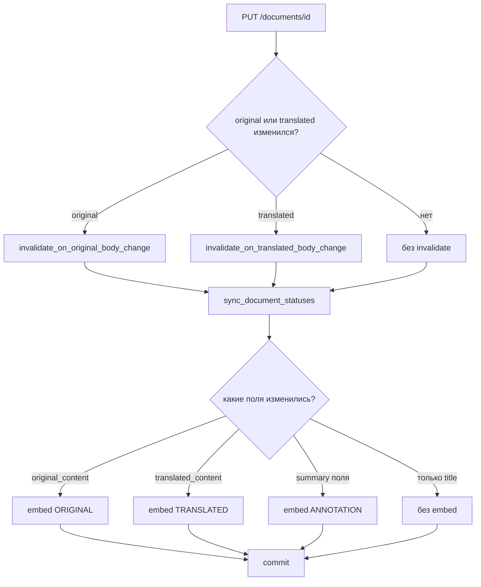

# Векторизация документов: сценарии и побочные эффекты

Документ описывает, **когда удаляются чанки/векторы**, **какие стадии переэмбеддируются**, и что происходит с **авто-тегами/сущностями/категориями**. Источник правды — `document_embedding.py`, `document_pipeline.py`, API `documents.py`.

---

## Три стадии эмбеддинга

| Стадия (`EmbeddingStage`) | Поле в БД (`chunk_type`) | Текст для fp и TEI | `language_id` чанка |
|---------------------------|--------------------------|-------------------|---------------------|
| `ORIGINAL` | `original` | `original_content` | `original_language_id` |
| `TRANSLATED` | `translated` | `translated_content` | `translated_language_id` |
| `ANNOTATION` | `annotation` | см. [текст аннотации](#текст-стадии-annotation) | `translated_language_id`, иначе `original_language_id`, иначе `ru` |

На документе хранятся отпечатки: `embedding_original_fp`, `embedding_translated_fp`, `embedding_annotation_fp` (SHA-256 от нормализованного текста: схлопнутые пробелы → `sha256`).

**«Свежий» эмбеддинг** в счётчиках processing API: fp совпадает с текстом **и** есть чанки стадии. `is_embedding_fresh()` в коде по-прежнему смотрит только fp (для быстрых проверок в Python).

---

## Общий алгоритм: `embed_document_if_stale`

Вызывается из `embed_document_stages_if_stale` (в той же DB-транзакции) или `embed_document_stages_best_effort` (отдельная сессия после commit).

```
┌─────────────────────────────────────────────────────────────┐
│ embedding_enabled == false  →  пропуск (skipped_disabled)   │
│ пустой текст стадии       →  пропуск (skipped_empty)        │
│ нет language_id           →  пропуск (кроме annotation → ru)│
│ fp совпадает И есть чанки →  пропуск (skipped_current)      │
│ иначе:                                                      │
│   1) TEI → векторы                                          │
│   2) удалить чанки ТОЛЬКО этой стадии (см. ниже)            │
│   3) вставить чанки + document_embeddings                   │
│   4) записать fp стадии в documents                         │
└─────────────────────────────────────────────────────────────┘
```

**Удаление чанков при пересчёте** — только точечное, в `_delete_stage_chunks`:

- `document_id` + `language_id` (текущий для стадии) + `chunk_type` (`original` / `translated` / `annotation`).

Чанки **других стадий** и **другого языка** (если сменился `translated_language_id`) не трогаются этим вызовом. Старые чанки с прежним `language_id` могут остаться «сиротами» до ручной очистки — на поиск по текущему языку не влияют.

**Повторный прогон без изменения текста:** если fp совпадает, но чанков нет (после сбоя TEI, ручного SQL и т.п.) — стадия **всё равно пересчитывается**.

**Ошибка TEI:** при `embedding_fail_open=true` (дефолт) исключение глотается (`status=failed`), fp **не обновляется**; старые чанки стадии **сохраняются** (удаление только после успешного TEI).

---

## Текст стадии `ANNOTATION`

Функция `_annotation_embed_text`:

1. Если есть и `translated_summary`, и `original_summary`, и они **различаются** →  
   `{translated}\n\n---\n\n{original}`
2. Иначе → непустой `translated_summary`, иначе `original_summary`.

Первичная аннотация (кнопка / SAQ) пишет результат в **`translated_summary`** (промпты на русском), поле `original_summary` при этом не заполняется автоматически.

---

## Инвалидация авто-производных

Две функции (ручные записи с `prediction_source = manual` не трогаются):

### `invalidate_on_original_body_change`

При изменении **оригинала** (`save` или отдельный вызов):

- авто-теги языка оригинала (`Tag.language_id = original_language_id`);
- все авто-сущности;
- все авто-категории.

### `invalidate_on_translated_body_change`

При изменении **перевода** (`save`, `persist_document_translation`):

- авто-теги языка перевода (`Tag.language_id = translated_language_id`);
- текст саммари **не удаляется**;
- `translated_summary_stale = true` выставляет вызывающий (save или persist перевода).

Сущности и категории при смене только перевода **не** сбрасываются (извлечение сущностей идёт с оригинала).

**Векторы/чанки** этими функциями не удаляются — только `embed_document_if_stale`.

При сохранении без саммари в теле запроса дополнительно: `original_summary_stale` / `translated_summary_stale`, если менялось соответствующее тело.

---

## Ручное сохранение (`PUT /api/v1/documents/{id}`)

Требуется блокировка (`POST …/lock`). Обработчик: `save_document_after_edit`.

| Что изменили в запросе | Инвалидация | Стадии embed (если текст стадии непустой) |
|------------------------|-------------|-------------------------------------------|
| `original_content` | теги оригинала, сущности, категории | `ORIGINAL` |
| `translated_content` | теги перевода; `translated_summary_stale` если саммари не в запросе | `TRANSLATED` |
| `original_summary` и/или `translated_summary` | нет | `ANNOTATION` |
| только `title` | нет | — |
| метаданные без тел/саммари | нет | — |

Несколько полей в одном сохранении → объединение (например, оригинал + саммари → invalidate оригинала + `ORIGINAL` + `ANNOTATION`).

**Важно:** правка только саммари **не** сбрасывает теги/сущности/категории и **не** трогает векторы `original` / `translated`.

---

## Кнопки и API-операции

### Перевод

| Endpoint | Pipeline | Embed |
|----------|----------|-------|
| `POST …/translate` | `run_translate_document` → `persist_document_translation` | `TRANSLATED` |
| `POST …/translate/stream` | стрим → `persist_document_translation` | `TRANSLATED` |
| SAQ `translate_document_job` | то же | `TRANSLATED` |

Побочные эффекты persist (как при сохранении перевода вручную):

- `translated_content`, `translated_language_id`;
- `translated_summary_stale = true` (саммари не удаляется);
- `invalidate_on_translated_body_change` — сброс авто-тегов перевода;
- опционально автоперевод заголовка (`translated_title`).

### Перевод заголовка

`POST …/translate-title` — только `translated_title`, **без embed**.

### Аннотирование (summary)

| Endpoint | Pipeline | Куда пишется текст | Embed |
|----------|----------|-------------------|-------|
| `POST …/summary` | `run_summary_document` → `persist_document_summary` | `translated_summary` | `ANNOTATION` |
| `POST …/summary/stream` | стрим → `persist_document_summary` | `translated_summary` | `ANNOTATION` |
| SAQ `annotate_document_job` | `run_summary_document`, source=`translated` | `translated_summary` | `ANNOTATION` |

Параметр `source` (`original` / `translated`) задаёт **какой текст статьи** уходит в LLM, но результат всегда в **`translated_summary`**.

### Уточнение аннотации (refine)

Бэкенд готов; на фронте появится позже.

| Endpoint | Pipeline | Куда пишется | Embed |
|----------|----------|--------------|-------|
| `POST …/summary/refine` | `run_refine_document` → `persist_document_refined_summary` | `translated_summary` | `ANNOTATION` |
| `POST …/summary/refine/stream` | стрим → `persist_document_refined_summary` | `translated_summary` | `ANNOTATION` |

Вход refine: статья по `source` (original/translated content), текущая аннотация — `translated_summary` или fallback `original_summary`. Без существующей аннотации — 400.

### Теги, категории, сущности

`POST …/tag`, `…/categorize`, `…/entity-extract` и SAQ-джобы — **не вызывают embed**, чанки не меняют.

### Метаданные

`PATCH …/metadata` (`update_document_metadata`) — заголовки, автор, даты, картинки, URL — **без embed**.

### Блокировка

`POST …/lock` — только lock, **без embed**.

---

## Создание документа

| Сценарий | Embed |
|----------|-------|
| `POST /documents/extract` (URL) | после commit: `ORIGINAL` (`best_effort`, отдельная сессия) |
| `POST /documents/from-raw` | `ORIGINAL`; + `TRANSLATED`, если передан `translated_content` |
| Пакетный парсинг источника (`parse_source_runner`) | `ORIGINAL` в той же транзакции, что создание |

---

## Сводная таблица: что удаляется

| Действие | Авто-производные | Чанки `original` | Чанки `translated` | Чанки `annotation` |
|----------|------------------|------------------|--------------------|--------------------|
| Сохранение: изменён оригинал | теги orig, сущности, категории | пересчёт* | нет | нет |
| Сохранение: изменён перевод | теги перевода; summary stale | нет | пересчёт* | нет |
| Сохранение: изменён саммари | нет | нет | нет | пересчёт* |
| Сохранение: только title | нет | нет | нет | нет |
| Кнопка «Перевод» | теги перевода; summary stale | нет | пересчёт* | нет |
| Кнопка «Аннотация» / SAQ annotate | нет | нет | нет | пересчёт стадии* |
| Refine | нет | нет | нет | пересчёт стадии* |
| Теги / категории / сущности | перезапись своих таблиц | нет | нет | нет |

\* Пересчёт = TEI → удаление чанков стадии → вставка новых; при совпадении fp и наличии чанков — пропуск. Другие стадии не затрагиваются.

---

## Диаграмма потока (ручное сохранение)



---

## Настройки

| Переменная | Смысл |
|------------|--------|
| `EMBEDDING_ENABLED` | глобальный выключатель |
| `EMBEDDING_FAIL_OPEN` | при ошибке TEI не ронять транзакцию |
| `EMBEDDING_CHUNK_CHARS` | размер чанка (дефолт 3500) |
| `EMBEDDING_CATALOG_MODEL_NAME` | запись в `embedding_models` |

---

## Заключение: рабочий ли сценарий

**Да, после разделения invalidate и embed сценарий согласован и пригоден к продакшену.** Три независимые стадии, точечное удаление чанков, fp только после успешного TEI, повторный embed при «fp есть, чанков нет» — закрывают класс бага «векторы снеслись, fp остался».

Модель поведения предсказуема:

- правка тела → пересчёт только нужной стадии + сброс авто-тегов/сущностей/категорий;
- кнопки LLM → пересчёт стадии, соответствующей результату (перевод / саммари);
- стадии не мешают друг другу.

### Известные ограничения

| Ограничение | Последствие |
|-------------|-------------|
| Смена `translated_language_id` | Старые чанки с прежним `language_id` могут остаться в БД (сироты) |
| Правка оригинала без правки саммари | Векторы `annotation` от старого текста саммари; `*_summary_stale` сигнализирует обновить аннотацию |
| Категории при смене только перевода | Не сбрасываются (categorize мог использовать перевод — при необходимости перезапустить вручную) |

---

## Связанные файлы

- `app/services/documents/document_embedding.py` — стадии, fp, TEI, чанки
- `app/services/documents/document_pipeline.py` — save, persist translate/summary/refine, invalidate
- `app/api/v1/endpoints/documents.py` — HTTP
- `app/services/processing/saq_tasks.py` — фоновые translate / annotate
